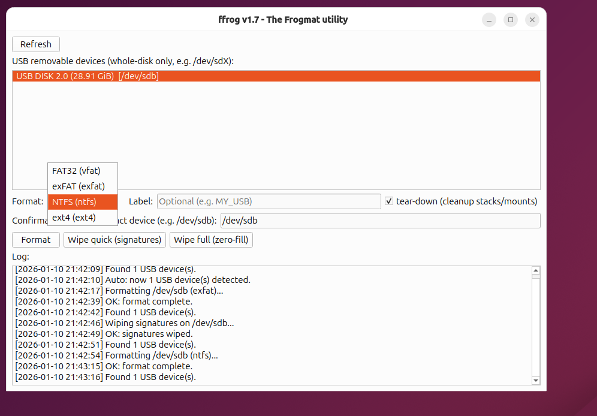

# ffrog — The Frogmat USB Utility 🐸💾

**ffrog** is a safe, no-nonsense USB formatting utility for Linux.

It focuses on **removable USB devices only**, avoids dangerous defaults, and provides a clean graphical interface built on top of **UDisks2**.  
The goal is simple: **format USB drives safely, clearly, and without bullshit**.

---

## Why ffrog exists

Formatting a USB drive on Linux is unnecessarily painful:

- Multiple commands (`lsblk`, `wipefs`, `mkfs`, `umount`, etc.)
- Easy to accidentally target the wrong disk
- GUI tools that hide critical details or try to be “smart”
- Poor feedback when something goes wrong

**ffrog** was created to solve exactly that.

It is:
- Explicit
- Restrictive (USB only)
- Transparent
- Hard to misuse

If you know what `/dev/sdb` means, **ffrog is for you**.

---

## Features

- ✅ **USB whole-disk detection only** (e.g. `/dev/sdX`)
- ✅ Prevents formatting system disks
- ✅ One-click formatting to:
  - FAT32 (vfat)
  - exFAT
  - NTFS
  - ext4
- ✅ Quick wipe (filesystem signatures)
- ✅ Full wipe (zero-fill)
- ✅ Optional teardown / cleanup of mounts before operations
- ✅ Confirmation field requiring the **exact device path**
- ✅ Automatic USB refresh and detection
- ✅ Detailed log with timestamps
- ✅ Qt6 graphical interface
- ✅ Non-blocking background operations

---

## Screenshot



---

## Logo


---

## Download

### Prebuilt binary (recommended)

Linux x86_64:

```

[https://github.com/victormeloasm/ffrog/releases/download/v1.7/ffrog-1.7-linux-x86_64.tar.gz](https://github.com/victormeloasm/ffrog/releases/download/v1.7/ffrog-1.7-linux-x86_64.tar.gz)

````

---

## Installation

### 1️⃣ Download and extract

```bash
wget https://github.com/victormeloasm/ffrog/releases/download/v1.7/ffrog-1.7-linux-x86_64.tar.gz
tar -xzf ffrog-1.7-linux-x86_64.tar.gz
cd ffrog-1.7
````

### 2️⃣ Run (temporary)

```bash
sudo ./ffrog
```

> Root privileges are required for formatting and wiping operations by design.

---

## Making ffrog available system-wide (recommended)

To call `ffrog` directly from the terminal like a native tool:

```bash
sudo install -m 755 ffrog /usr/local/bin/ffrog
```

Now you can run it from anywhere:

```bash
sudo ffrog
```

---

## Desktop integration (optional)

Create a desktop entry:

```bash
sudo nano /usr/share/applications/ffrog.desktop
```

Paste:

```ini
[Desktop Entry]
Name=ffrog
Comment=USB Formatting Utility
Exec=sudo ffrog
Icon=/usr/local/share/ffrog/logo.png
Terminal=false
Type=Application
Categories=System;Utility;
```

Then install the icon:

```bash
sudo mkdir -p /usr/local/share/ffrog
sudo cp assets/logo.png /usr/local/share/ffrog/logo.png
```

---

## Usage

### Typical workflow

1. Insert a USB drive
2. Launch `ffrog`
3. Select the detected USB device (whole disk)
4. Choose filesystem
5. (Optional) Set a label
6. Type the exact device path (e.g. `/dev/sdb`)
7. Click **Format** or **Wipe**
8. Watch the log — nothing happens silently

---

## Safety model

**ffrog is intentionally restrictive**:

* Only removable USB drives are shown
* Only whole disks (`/dev/sdX`) are accepted
* You must manually confirm the device path
* Root privileges are mandatory
* No “smart guessing”, no auto-selection

If something feels annoying — it is probably protecting your system.

---

## Technical details

* Language: **C++23**
* GUI: **Qt6 Widgets**
* Device management: **UDisks2 (DBus)**
* Platform: **Linux**
* Build system: **CMake + Makefile**
* Compilers: `clang++` or `g++`
* Portable build (no `-march=native`)

---

## Philosophy

ffrog is not meant to be:

* A general disk manager
* A Windows clone
* A beginner toy

It is a **precise tool**, built by someone who formats drives often and got tired of unreliable workflows.

---

## License

See `LICENSE` file.

---

## Author

Created by **Victor Duarte Melo**
Independent Researcher
GitHub: [https://github.com/victormeloasm](https://github.com/victormeloasm)

---

🐸 *Fast. Explicit. Safe.*
